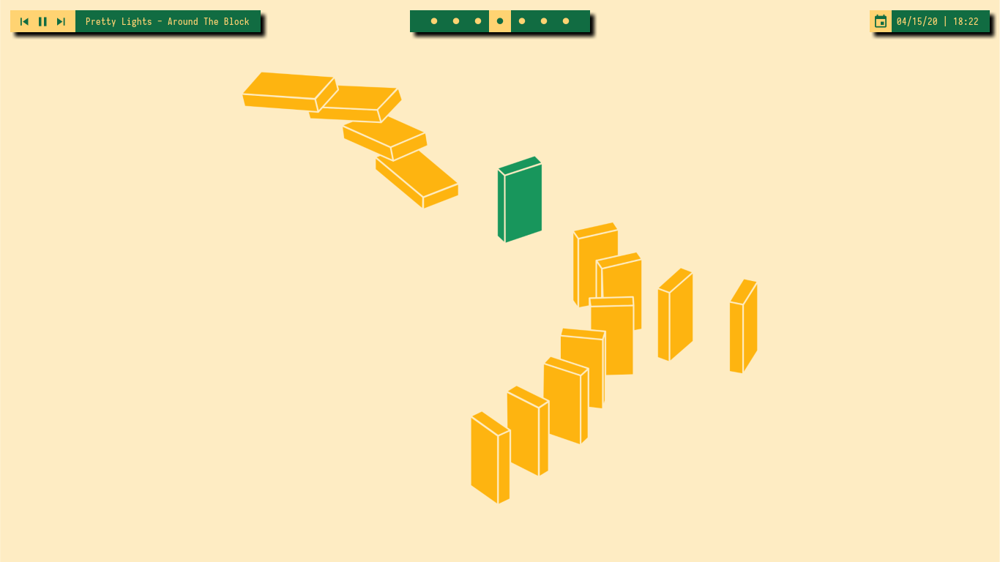
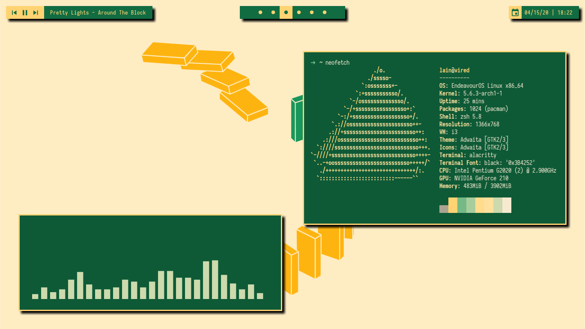
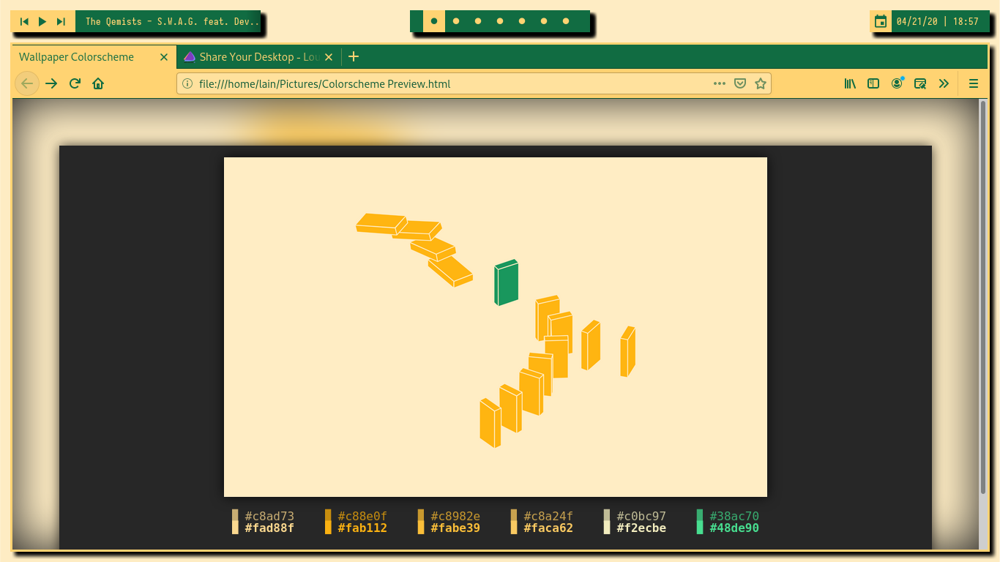

# green-candy-i3wm-theme
A green and yellow eyecandy for your i3wm!

## Screenshots







## Installation

### Get the dependencies

```
yay -S i3-gaps polybar picom pywal rofi dmenu
```
### Install Fonts
[Iosevka Nerd Font](https://www.nerdfonts.com/font-downloads)

### Clone this repo

```
git clone --depth 1 https://github.com/flyingcakes85/green-candy-i3wm-theme.git
```

### Copy the files

  * Copy the files from `.config` folder of my repo to your `~/.config/`  folder. Of course, make backups before proceeding.
  * Copy the wallpaper from `Pictures` folder of my repo to your `~/Pictures/`

### Initial pywal run

Log out from your current desktop environment and log in to i3. Open a terminal emulator (`Mod + d`, then type name of the terminal emulator you use). Run the following command.
```
wal -i ~/Pictures/wall.png 
```

### Firefox Theme

Firefox Theme can be found [here](https://addons.mozilla.org/en-US/firefox/addon/green-candy-theme/).

### VSCode Theme
For VSCode to follow pywal theme, install the [`wal`](https://marketplace.visualstudio.com/items?itemName=cmschuetz12.wal) extension from Visual Studio Marketplace.

## Credits
Wallpaper '[Social Distancing](http://simpledesktops.com/browse/desktops/2020/mar/16/social-distancing/)' by [Willem Perquin](https://www.willempirquin.be/).

## Contribute!
If you find any errors in here, or have suggestions please create a post in the issues tab! I'll try to get back soon. Thank You!
